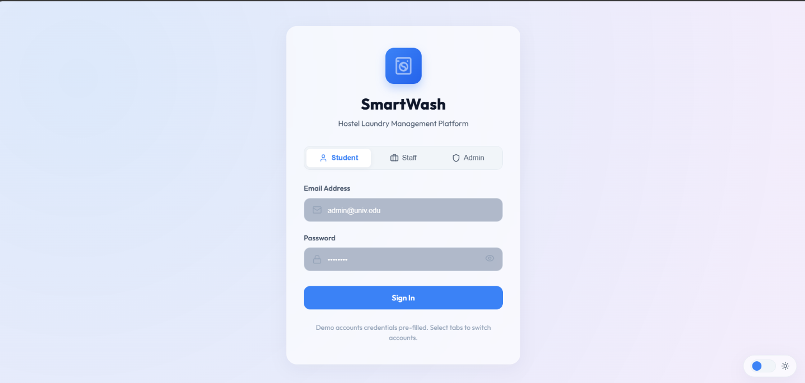
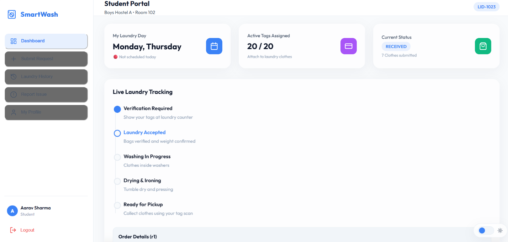
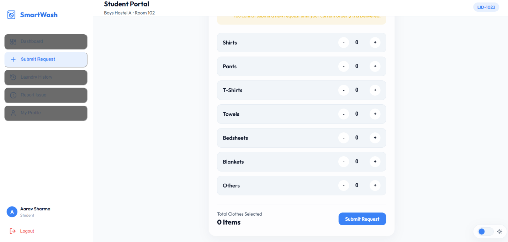
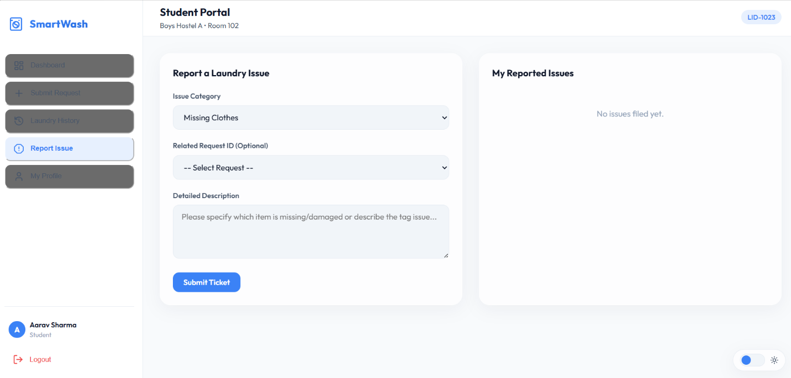
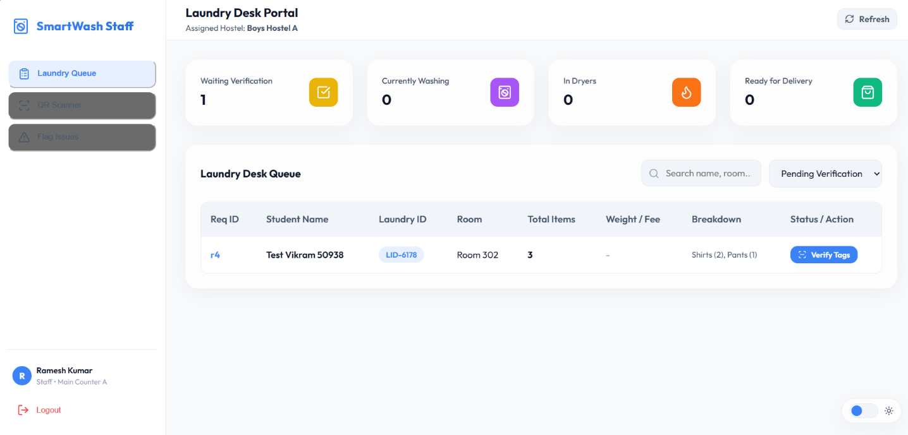
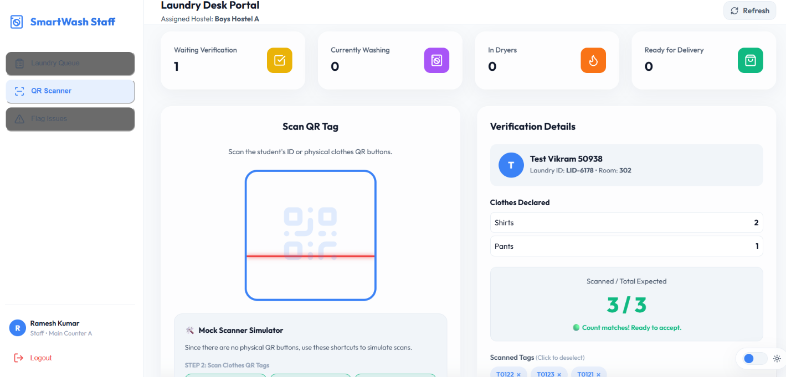
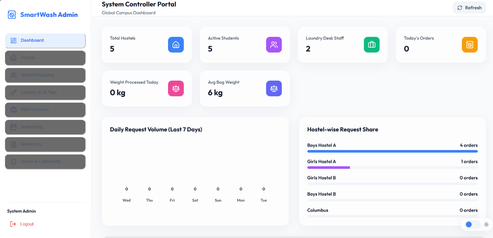
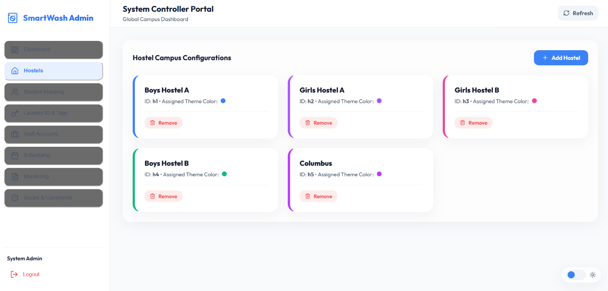
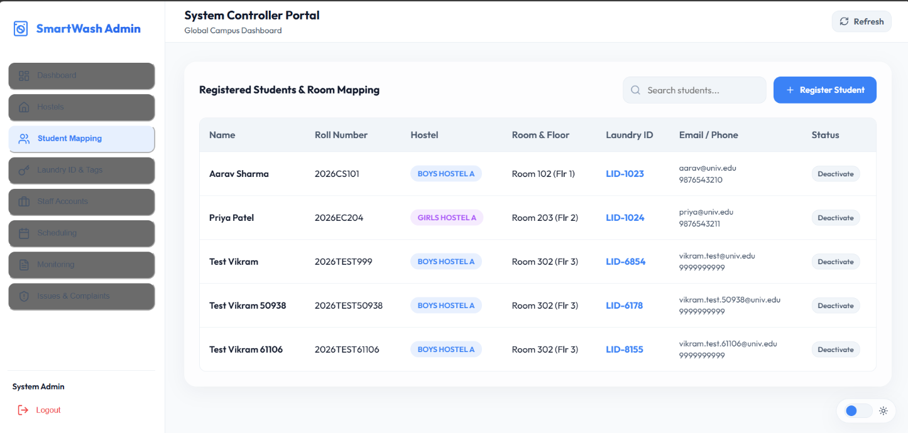
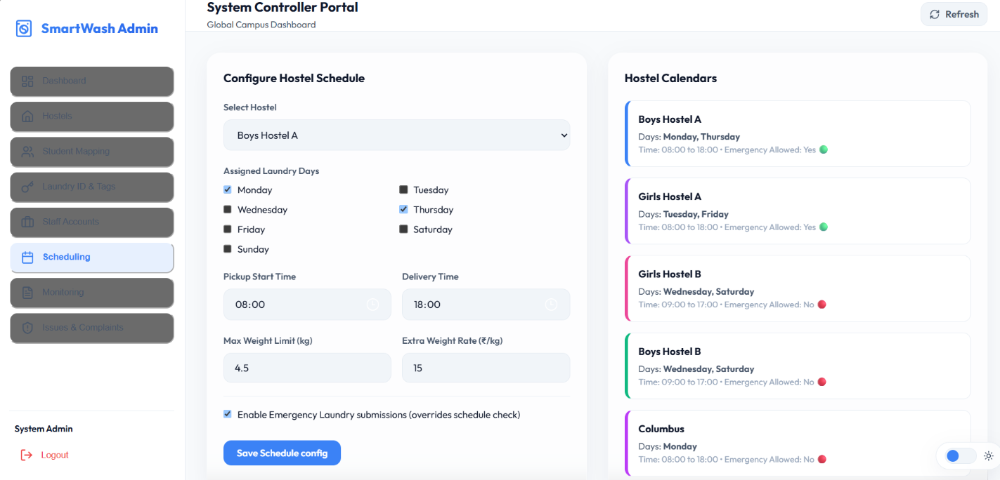

# 🧺 SmartWash  
# Smart Hostel Laundry Management System

<p align="center">


</p>


<p align="center">
A full-stack SaaS platform that digitizes hostel laundry operations with smart tracking, QR verification, and role-based management.
</p>


---

# 📌 Overview

**SmartWash** is a commercial-grade hostel laundry management system designed for universities, hostels, PG accommodations, and residential campuses.

The platform transforms traditional manual laundry processes into a completely digital workflow where students can submit requests, staff can verify and process clothes, and administrators can manage complete laundry operations.


## 👥 User Roles

| Role | Description |
|---|---|
| 👨‍🎓 Student | Submit laundry requests and track status |
| 🧑‍🔧 Laundry Staff | Verify, process and deliver laundry |
| 🛡️ Administrator | Manage complete laundry ecosystem |


---

# 🚨 Problem Statement

Traditional hostel laundry systems suffer from:

- Manual record keeping
- Lost clothing items
- No real-time tracking
- Quantity mismatch issues
- Poor communication between students and laundry staff
- Lack of operational monitoring


---

# 💡 Solution

SmartWash provides a centralized digital laundry ecosystem with:

✅ Online laundry booking  
✅ QR-based clothing verification  
✅ Real-time laundry tracking  
✅ Automated scheduling  
✅ Complaint management  
✅ Role-based dashboards  
✅ Hostel-wise management  


---

# 🔄 Laundry Workflow


```
Student Creates Request

          ↓

Laundry Bag Verification

          ↓

QR Tag Scanning

          ↓

Laundry Accepted

          ↓

Washing

          ↓

Drying

          ↓

Ready For Pickup

          ↓

Delivered

```


---

# 📸 Application Screenshots


## 🔐 Authentication System


SmartWash provides role-based login access for:

- Students
- Laundry Staff
- Administrators





---

# 👨‍🎓 Student Portal


## Student Dashboard


Students can monitor their complete laundry journey.


### Features:

- View current laundry status
- Track order progress
- Check laundry schedule
- View active QR tags
- Access previous requests





---

## 📦 Laundry Request Submission


Students can create laundry requests by selecting clothing categories.


Supported items:

- Shirts
- Pants
- T-Shirts
- Towels
- Bedsheets
- Blankets
- Other clothes





---

## 📍 Real-Time Tracking Timeline


Laundry status follows:


```
Waiting For Verification

          ↓

Received

          ↓

Washing

          ↓

Drying

          ↓

Ready

          ↓

Delivered

```


---

## ⚠️ Complaint Management


Students can report:

- Missing clothes
- Damaged clothes
- Incorrect quantity
- Other laundry issues





---

# 🧑‍🔧 Laundry Staff Portal


## Staff Dashboard


Laundry desk staff can manage hostel laundry operations.


Features:

- View incoming requests
- Verify laundry bags
- Update laundry status
- Manage deliveries
- Create issue tickets





---

## 🔍 QR Verification System


SmartWash uses QR-based verification to prevent mistakes.


Workflow:


```
Scan Student Laundry ID

          ↓

Scan Individual Clothing Tags

          ↓

Match Expected Quantity

          ↓

Accept Laundry

```


Benefits:

- Prevents missing items
- Improves transparency
- Reduces manual errors





---

# 🛡️ Administrator Portal


The admin panel provides complete control over hostel laundry operations.


---

## 📊 Operational Dashboard


Admin can monitor:


- Total hostels
- Active students
- Staff members
- Pending requests
- Laundry statistics
- Recent activities





---

## 🏢 Hostel Management


Administrators can:

- Register hostels
- Configure hostel details
- Manage floors and rooms
- Assign themes





---

## 👨‍🎓 Student Management


Admin can:

- Register students
- Assign hostels
- Map rooms
- Generate Laundry IDs
- Allocate QR tags





---

## 📅 Laundry Scheduler


Admin can configure:


- Laundry pickup days
- Delivery timings
- Emergency submissions
- Hostel specific rules



---

# ✨ Key Features


## 👨‍🎓 Student Features


| Feature | Description |
|---|---|
| Laundry Request | Submit clothes digitally |
| Live Tracking | Track laundry progress |
| QR Tags | Unique clothing identification |
| Schedule Check | Restrict requests based on laundry days |
| Complaint System | Report missing or damaged clothes |
| History | View previous laundry records |


---

## 🧑‍🔧 Laundry Staff Features


| Feature | Description |
|---|---|
| Queue Management | Manage incoming laundry requests |
| QR Scanner | Verify student and clothing tags |
| Quantity Matching | Prevent item mismatch |
| Status Updates | Update washing stages |
| Delivery Verification | Confirm successful delivery |
| Issue Logger | Report laundry problems |


---

## 🛡️ Administrator Features


| Feature | Description |
|---|---|
| Analytics Dashboard | Monitor laundry operations |
| Hostel Management | Configure hostel structure |
| Student Mapping | Manage students and rooms |
| Staff Management | Create desk accounts |
| Scheduler | Configure laundry timings |
| Issue Desk | Resolve complaints |


---

# 🏗️ System Architecture


```
                 USERS

     Student     Staff     Admin

          \        |        /

              React Frontend

                    |

             Express REST API

                    |

              JSON Database

```


---

# 🔧 Technology Stack


## Frontend

- React.js
- Vite
- JavaScript
- Vanilla CSS
- CSS Variables
- Lucide React Icons


## Backend

- Node.js
- Express.js
- CORS


## Database

- JSON File Database


## Development Tools

- Git
- GitHub
- VS Code
- npm


---

# 📂 Project Structure


```
SmartWash

│
├── frontend
│
│   ├── src
│   ├── components
│   ├── pages
│   └── assets
│
│
├── backend
│
│   ├── server.js
│   ├── routes
│   └── data
│
│
├── screenshots
│
└── README.md

```


---

# 🚀 Installation & Setup


## 1. Clone Repository


```bash
git clone <your-repository-url>

cd SmartWash
```


---

# Backend Setup


Navigate to backend folder:


```bash
cd backend
```


Install dependencies:


```bash
npm install
```


Start backend server:


```bash
node server.js
```


Backend will run on:


```
http://localhost:5000
```


---

# Frontend Setup


Open another terminal:


```bash
cd frontend
```


Install dependencies:


```bash
npm install
```


Start development server:


```bash
npm run dev
```


Frontend will run on:


```
http://localhost:5173
```


---

# 🔑 Demo Credentials


## 🛡️ Administrator Account


```
Email:
admin@univ.edu

Password:
admin123
```


---

## 🧑‍🔧 Laundry Staff Account


```
Email:
staff@univ.edu

Password:
staff123
```


---

## 👨‍🎓 Student Account


```
Name:
Aarav Sharma


Email:
aarav@univ.edu


Password:
aarav123
```


---

# 🌟 Future Enhancements


## 📱 Mobile Application

A dedicated Android/iOS application for students and staff.


## ☁️ Cloud Deployment

Migration from JSON storage to:

- MongoDB
- PostgreSQL
- Cloud databases


## 🔔 Real-Time Notifications

Notifications for:

- Laundry received
- Washing completed
- Ready for pickup


## 🔐 Advanced Identification

Integration with:

- RFID cards
- NFC tags
- Smart campus systems


## 🤖 AI Integration

Future AI features:

- Laundry demand prediction
- Workload optimization
- Smart scheduling


## 📊 Advanced Analytics

Including:

- Monthly reports
- Usage patterns
- Hostel comparisons


---

# 🎯 Project Highlights


⭐ Complete Role-Based SaaS Architecture

⭐ QR Powered Laundry Tracking

⭐ Real-Time Workflow Management

⭐ Modern Responsive Interface

⭐ Hostel Automation Solution

⭐ End-to-End Laundry Lifecycle Management


---

# 📌 Why SmartWash?


SmartWash is not just a laundry booking application.

It is a complete digital transformation solution for hostel laundry operations that improves:

- Transparency
- Efficiency
- Accountability
- User Experience


---

# 👩‍💻 Developer


## Priyanshi Soni

Computer Science Engineering Student


---


